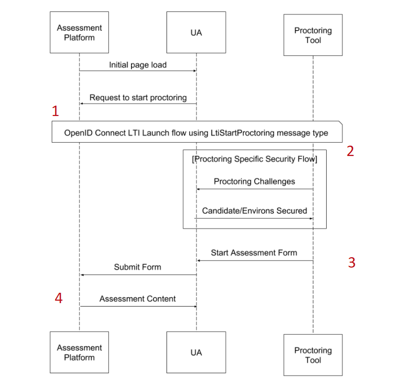

# Proctoring Messages Workflow

> How to [perform secured proctoring message interactions](https://www.imsglobal.org/spec/proctoring/v1p0#h.s9djysqqig55), between platforms and tools.

## Workflow

You can find below a proctoring messages workflow diagram, with steps numbers:



Each step will be detailed below, from both platform and tool perspectives.

## Table of contents

- [1 - Platform side: StartProctoring message generation](#1---platform-side-startproctoring-message-generation)
- [2 - Tool side: StartProctoring message handling](#2---tool-side-startproctoring-message-handling)
- [3 - Tool side: StartAssessment message generation](#3---tool-side-startassessment-message-generation)
- [4 - Platform side: StartAssessment message handling](#4---platform-side-startassessment-message-handling)

## 1 - Platform side: StartProctoring message generation

You can find below required steps to generate a StartProctoring message, needed only if you're acting as a platform.

### Create the message

As a platform, you can create a [StartProctoring message](https://www.imsglobal.org/spec/proctoring/v1p0#h.nah6ikt241z1) for a tool within the context of a registration.

Platforms can drive the tool behaviour on proctoring interactions by providing [claims](https://www.imsglobal.org/spec/proctoring/v1p0#h.ar7r4fwv67k2) in this message.

You can use the [StartProctoringLaunchRequestBuilder](../../src/Message/Launch/Builder/StartProctoringLaunchRequestBuilder.php) to create the message:

```php
<?php

use OAT\Library\Lti1p3Core\Registration\RegistrationRepositoryInterface;
use OAT\Library\Lti1p3Core\Resource\LtiResourceLink\LtiResourceLink;
use OAT\Library\Lti1p3Proctoring\Message\Launch\Builder\StartProctoringLaunchRequestBuilder;

// Create a resource link
$resourceLink = new LtiResourceLink('resourceLinkIdentifier');

// Create a builder instance
$builder = new StartProctoringLaunchRequestBuilder();

// Get related registration of the launch
/** @var RegistrationRepositoryInterface $registrationRepository */
$registration = $registrationRepository->find(...);

// Build StartProctoring message
$message = $builder->buildStartProctoringLaunchRequest(
    $resourceLink,                                                 // [required] resource link
    $registration,                                                 // [required] related registration
    'http://platform.com/start-assessment',                        // [required] platform url where to send later the StartAssessment message
    'loginHint',                                                   // [required] login hint that will be used afterwards by the platform to perform authentication
    1,                                                             // [optional] attempt number (default 1)
    null,                                                          // [optional] will use the registration default deployment id, but you can pass a specific one
    ['http://purl.imsglobal.org/vocab/lis/v2/membership#Learner'], // [optional] roles
    ['myCustomClaim' => 'myCustomValue']                           // [optional] supplementary claims if needed
);
```

### Launch the message

As a result of the build, you get a [LtiMessageInterface](../../src/Message/LtiMessageInterface.php) instance that has to be used in the following ways:

```php
<?php

use OAT\Library\Lti1p3Core\Message\LtiMessageInterface;

/** @var LtiMessageInterface $message */

// Main message properties you can use as you want to offer the launch to the platform users
echo $message->getUrl();                // url of the launch
echo $message->getParameters()->all();  // array of parameters of the launch

// Or use those helpers methods to ease the launch interactions
echo $message->toUrl();                // url with launch parameters as query parameters
echo $message->toHtmlLink('click me'); // HTML link, where href is the output url
echo $message->toHtmlRedirectForm();   // HTML hidden form, with possibility of auto redirection
```

### Implement OpenId Connect launch flow

Like any platform originating message, when the StartProctoring message is launched, an [OIDC flow](https://www.imsglobal.org/spec/security/v1p0/#platform-originating-messages) will start between the tool and the platform.

The underlying core library offers everything you need to securely implement this flow, as documented in the [platform originating messages documentation](https://github.com/oat-sa/lib-lti1p3-core/blob/master/doc/message/platform-originating-messages.md).

## 2 - Tool side: StartProctoring message handling

You can find below required steps to handle a StartProctoring message, needed only if you're acting as a tool.

### Validate the message 

As a tool, you'll receive an HTTP request containing the [StartProctoring message](https://www.imsglobal.org/spec/proctoring/v1p0#h.nah6ikt241z1), generated by the platform, received after OIDC flow completion.

You can use the [ToolLaunchValidator](https://github.com/oat-sa/lib-lti1p3-core/blob/master/src/Message/Launch/Validator/ToolLaunchValidator.php) to validate it:

```php
<?php

use OAT\Library\Lti1p3Core\Message\Launch\Validator\ToolLaunchValidator;
use OAT\Library\Lti1p3Core\Registration\RegistrationRepositoryInterface;
use OAT\Library\Lti1p3Core\Security\Nonce\NonceRepositoryInterface;
use Psr\Http\Message\ServerRequestInterface;

/** @var RegistrationRepositoryInterface $registrationRepository */
$registrationRepository = ...

/** @var NonceRepositoryInterface $nonceRepository */
$nonceRepository = ...

/** @var ServerRequestInterface $request */
$request = ...

// Create the validator
$validator = new ToolLaunchValidator($registrationRepository, $nonceRepository);

// Perform validation
$result = $validator->validatePlatformOriginatingLaunch($request);

if (!$result->hasError()) {
    // Your logic to handle the StartProctoring message and offer proctor candidate attempt validation
}
```
**Note**: more details about platform originating messages on tool side validation can be found in the [platform originating messages documentation](https://github.com/oat-sa/lib-lti1p3-core/blob/master/doc/message/platform-originating-messages.md#4---tool-side-launch-validation).

### Offer proctor validation

When a StartProctoring message is received by a tool, the tool may offer various ways to the proctor to validate candidate attempt (webcam, etc).

Since this process can differ a lot between proctoring tool applications, this library **does not provide any tooling for this** (to leave you free to provide your own process or to delegate to external ones). 

The library will take care of the rest of the process, when the tool will redirect the candidate to the platform.

## 3 - Tool side: StartAssessment message generation

You can find below required steps to generate a StartAssessment message to return to the platform, needed only if you're acting as a tool.

### Create the message

Once the proctor's candidate attempt validation is done, you can return to the platform using a [StartAssessment message](https://www.imsglobal.org/spec/proctoring/v1p0#h.a81u3sn00k84), by using the [StartAssessmentLaunchRequestBuilder](../../src/Message/Launch/Builder/StartAssessmentLaunchRequestBuilder.php):

```php
<?php

use OAT\Library\Lti1p3Core\Message\Launch\Validator\Result\LaunchValidationResult;
use OAT\Library\Lti1p3Core\Registration\RegistrationRepositoryInterface;
use OAT\Library\Lti1p3Proctoring\Message\Launch\Builder\StartAssessmentLaunchRequestBuilder;

/** @var LaunchValidationResult $result */
$result = $validator->validatePlatformOriginatingLaunch(...);

// Create a builder instance
$builder = new StartAssessmentLaunchRequestBuilder();

// Message payload from previous StartProctoring message step
$payload = $result->getPayload();

// Get related registration of the launch
/** @var RegistrationRepositoryInterface $registrationRepository */
$registration = $registrationRepository->find(...);

// Build a StartAssessment message
$message = $builder->buildStartAssessmentLaunchRequest(
    $payload->getResourceLink(),                           // [required] resource link as provided in StartProctoring message
    $registration,                                         // [required] related registration
    $payload->getProctoringStartAssessmentUrl(),           // [required] platform StartAssessment url as provided in StartProctoring message
    $payload->getProctoringSessionData(),                  // [required] session data as provided in StartProctoring message
    $payload->getProctoringAttemptNumber(),                // [required] attempt number as provided in StartProctoring message
    null,                                                  // [optional] will use the registration default deployment id, but you can pass a specific one
    ['myCustomClaim' => 'myCustomValue']                   // [optional] supplementary claims if needed
);
```

**Note**: to ease a bit this step, you can also use the `buildStartAssessmentLaunchRequestFromPayload()` method to work directly with the previous StartProctoring message payload if you still can access it:

```php
<?php

use OAT\Library\Lti1p3Core\Message\Launch\Validator\Result\LaunchValidationResult;
use OAT\Library\Lti1p3Core\Registration\RegistrationRepositoryInterface;
use OAT\Library\Lti1p3Proctoring\Message\Launch\Builder\StartAssessmentLaunchRequestBuilder;

/** @var LaunchValidationResult $result */
$result = $validator->validatePlatformOriginatingLaunch(...);

// Create a builder instance
$builder = new StartAssessmentLaunchRequestBuilder();

// Message payload from previous StartProctoring message step
$payload = $result->getPayload();

// Get related registration of the launch
/** @var RegistrationRepositoryInterface $registrationRepository */
$registration = $registrationRepository->find(...);

// Build a StartAssessment message
$message = $builder->buildStartAssessmentLaunchRequestFromPayload(
    $payload,                                  // [required] provided in StartProctoring message payload
    $registration,                             // [required] related registration
    null,                                      // [optional] will use the registration default deployment id, but you can pass a specific one
    ['myCustomClaim' => 'myCustomValue']       // [optional] supplementary claims if needed
);
```

### Launch the message

As a result of the build, you get a [LtiMessageInterface](../../src/Message/LtiMessageInterface.php) instance that has to be sent as a form POST:

```php
<?php

use OAT\Library\Lti1p3Core\Message\LtiMessageInterface;

/** @var LtiMessageInterface $message */
echo $message->toHtmlRedirectForm(); // HTML form containing the auto generated JWT parameter
```

## 4 - Platform side: StartAssessment message handling

You can find below required steps to validate a StartAssessment message, needed only if you're acting as a platform.

### Validate the message

As a platform, you'll receive an HTTP request containing the StartAssessment message.

The [PlatformLaunchValidator](https://github.com/oat-sa/lib-lti1p3-core/blob/master/src/Message/Launch/Validator/PlatformLaunchValidator.php) can be used for this:

- it requires a registration repository and a nonce repository implementations [as explained here](https://github.com/oat-sa/lib-lti1p3-core/blob/master/doc/quickstart/interfaces.md)
- it expects a [PSR7 ServerRequestInterface](https://www.php-fig.org/psr/psr-7/#321-psrhttpmessageserverrequestinterface) to validate
- it will output a [LaunchValidationResult](https://github.com/oat-sa/lib-lti1p3-core/blob/master/src/Message/Launch/Validator/Result/LaunchValidationResult.php) representing the launch validation, the related registration and the StartAssessment payload itself.

```php
<?php

use OAT\Library\Lti1p3Core\Message\Launch\Validator\PlatformLaunchValidator;
use OAT\Library\Lti1p3Core\Registration\RegistrationRepositoryInterface;
use OAT\Library\Lti1p3Core\Security\Nonce\NonceRepositoryInterface;
use Psr\Http\Message\ServerRequestInterface;

/** @var RegistrationRepositoryInterface $registrationRepository */
$registrationRepository = ...

/** @var NonceRepositoryInterface $nonceRepository */
$nonceRepository = ...

/** @var ServerRequestInterface $request */
$request = ...

// Create the validator
$validator = new PlatformLaunchValidator($registrationRepository, $nonceRepository);

// Perform validation
$result = $validator->validateToolOriginatingLaunch($request);

if (!$result->hasError()) {
    // Your logic to handle the StartAssessment message: start the candidate attempt for example
}
```
**Note**: more details about tool originating messages on platform side validation can be found in the [tool originating messages documentation](https://github.com/oat-sa/lib-lti1p3-core/blob/master/doc/message/tool-originating-messages.md#2---platform-side-launch-validation).

